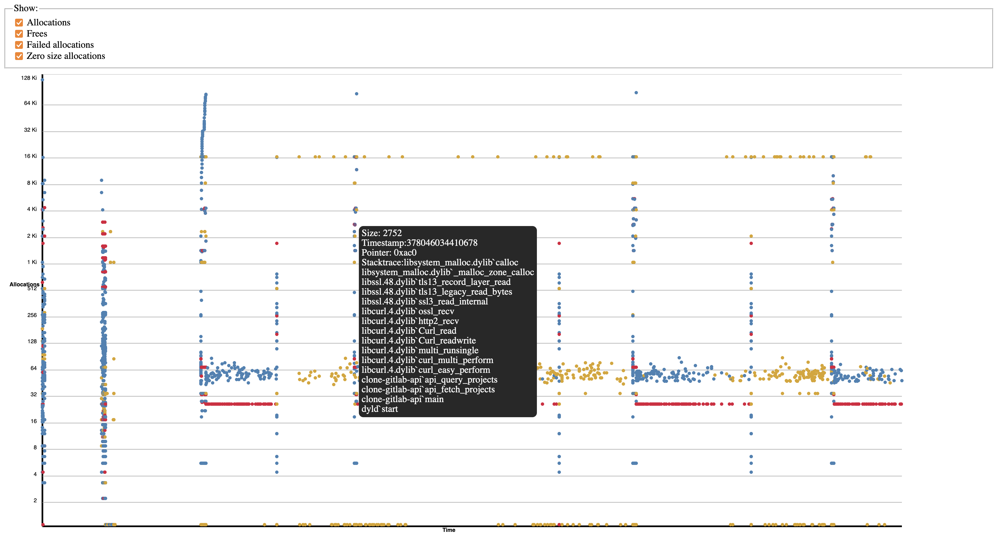

# A simple memory profiler for macOS and BSDs

</img>

A simple way to trace all memory (de-)allocations, without any code change required. 
- No dependencies. 
- Can attach to a running application or start one. 
- Works with any programming language using libc, and can also be easily extended to support those that don't.
- See the stacktrace of a (de-)allocation
- Match an allocation with its deallocation:

    </img> 


## Quick start

*Let's trace git!*

```sh
$ sudo ./alloc.d -c "git status" -o /tmp/git-status.dtrace
$ ./dtrace-alloc-postprocess /tmp/git-status.dtrace > /tmp/mem.html
$ open /tmp/mem.html
```

## Requirements

- Administrator access for dtrace 
- On macOS, System Integrity Protection (SIP) disabled (required to run dtrace on recent versions of macOS, unfortunately)
- A browser to see the chart


## Build

**Requires a C99 compiler and make**

```sh
$ make
```


Should work on BSDs but has not been tested yet.


## Why?

- Simple, fast, no setup
- The built-in memory profiler from macOS did not work for my code
- Third-party code is usually not amenable to custom allocators to trace their allocations
- I have used this tool to great effect to improve the allocation pattern of my code, or to find leaks


## Limits

- Trace files can become huge (maybe compression would help? Need to look into that!)
- Dtrace adds some overhead
- Dtrace reports stack offsets for code locations, not the source code line. We could parse the debug symbols to match those offset to the source code lines.
